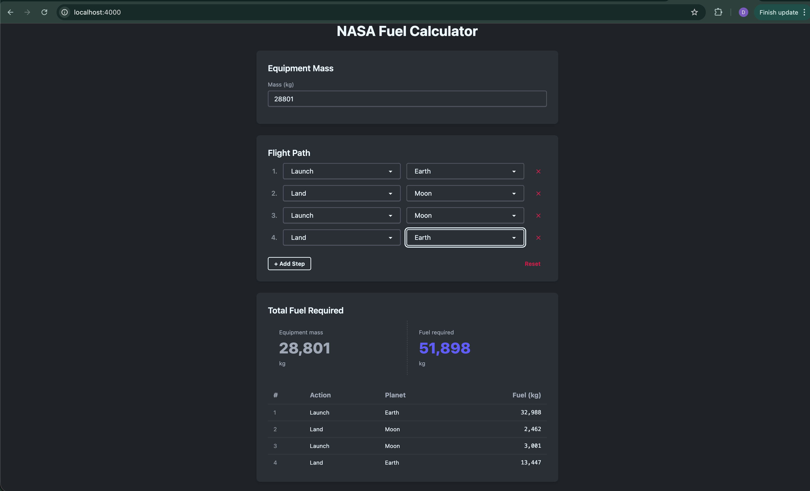

# NASA Fuel Calculator

An Elixir + Phoenix LiveView application that calculates the required fuel for interplanetary travel.

Built as part of an Elixir Full-Stack Challenge.



---

## Features

- Dynamic flight path builder (add/remove/reorder launch and landing steps)
- Real-time fuel calculation as you type — no page reloads
- Per-step fuel breakdown table
- Flight path validation (no consecutive same actions, launch planet must match last landing)
- Supports Earth, Moon, and Mars
- Accounts for fuel mass recursively (fuel needs its own fuel)
- Form validation with inline errors

---

## Stack

- **Elixir / OTP**
- **Phoenix 1.8.3** with LiveView
- **DaisyUI** (via Phoenix 1.8 integration)
- No database — all state in the LiveView socket

---

## Setup

**Prerequisites:** Elixir ~> 1.18, Erlang/OTP 27+

If you use [asdf](https://github.com/asdf-vm/asdf) or [mise](https://mise.jdx.dev), the `.tool-versions` file pins the exact versions — run `asdf install` or `mise install` to install them automatically.

```bash
git clone https://github.com/divijjain/nasa-fuel-calculator.git
cd nasa-fuel-calculator
mix deps.get
mix phx.server
```

Visit [http://localhost:4000](http://localhost:4000)

---

## Running Tests

```bash
mix test
```

---

## Fuel Calculation Logic

### Formulas

```
Launch fuel  = floor(mass × gravity × 0.042 − 33)
Landing fuel = floor(mass × gravity × 0.033 − 42)
```

### Iterative Accumulation

Fuel adds weight to the ship, so it requires its own fuel. The calculation repeats until the additional fuel required is 0 or negative.

**Example — landing Apollo 11 CSM (28801 kg) on Earth (g = 9.807):**

```
28801 × 9.807 × 0.033 − 42 = 9278   → needs more fuel
 9278 × 9.807 × 0.033 − 42 = 2960   → needs more fuel
 2960 × 9.807 × 0.033 − 42 = 915    → needs more fuel
  915 × 9.807 × 0.033 − 42 = 254    → needs more fuel
  254 × 9.807 × 0.033 − 42 = 40     → needs more fuel
   40 × 9.807 × 0.033 − 42 = −28.3  → stop

Total landing fuel: 9278 + 2960 + 915 + 254 + 40 = 13447 kg
```

---

## Verification Scenarios

Use these to confirm the app is working correctly.

### Apollo 11

| Field | Value |
|-------|-------|
| Equipment mass | 28801 kg |
| Flight path | Launch Earth → Land Moon → Launch Moon → Land Earth |
| **Expected total fuel** | **51898 kg** |

### Mars Mission

| Field | Value |
|-------|-------|
| Equipment mass | 14606 kg |
| Flight path | Launch Earth → Land Mars → Launch Mars → Land Earth |
| **Expected total fuel** | **33388 kg** |

### Passenger Ship

| Field | Value |
|-------|-------|
| Equipment mass | 75432 kg |
| Flight path | Launch Earth → Land Moon → Launch Moon → Land Mars → Launch Mars → Land Earth |
| **Expected total fuel** | **212161 kg** |

---

## Planet Gravity Reference

| Planet | Gravity (m/s²) |
|--------|---------------|
| Earth  | 9.807 |
| Moon   | 1.62 |
| Mars   | 3.711 |

---

## Project Structure

```
lib/
├── nasa_fuel_calculator/
│   └── fuel.ex                  # Pure domain logic
└── nasa_fuel_calculator_web/
    └── live/
        └── mission_live.ex      # LiveView UI

test/
└── nasa_fuel_calculator/
    └── fuel_test.exs
```

See `CONTEXT.md` for full architecture notes and design decisions.
